# javatodo web开发系统说明文档
# 第一章	流程图
 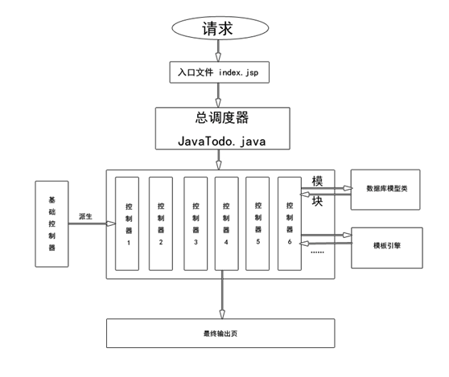  
# 第二章	基础介绍
首先引入四个名词，分别是：“入口文件”、“模块”、“控制器”、“操作”。
下面详细介绍这四个名词。
# 一、	入口文件
入口文件是外部访问项目时的入口，也就是所有的访问请求都会通过入口文件传入框架内部，那么应用至少需要一个入口文件。该框架采用单一入口模式进行项目部署和访问，无论完成什么功能，一个应用都有一个统一（但不一定是 唯一）的入口。框架已内置入口文件，在WebContent文件夹下面的index.jsp文件，使用者只需要知道该文件是入口文件即可，该文件一般不需要做特殊更改。
# 二、	模块
当应用比较大的时候需要分为不同的模块，比如一个商城需要有商品模块、栏目模块、购物车模块、会员模块……那么针对模块，该框架一般认为一个包就是一个“模块”，那么商品模块的包名可以定义为“com.app.goods”，购物车模块的包名可以定义为“com.app.cart”……为了方便测试和调试，框架内置了一个com.javatodo.app的包，其实在实际部署过程中可以随意设置。
#三、	控制器
定义了模块以后，就需要针对不同的功能项来做具体开发，那么一个功能项就可以当成一个“控制器”，比如会员模块中有“会员管理”、“会员等级”……等等功能，那么我们就可以定义“Member”类来开发会员管理的功能，定义“MemberLevelController”类来开发会员等级的功能。注意，定义的这个“MemberController”类和“MemberLevelController”类需要继承“com.javatodo.core.controller.Controller”类，该框架认为，模块（也就是包）中的一个继承了“com.javatodo.core.controller.Controller”类的java类就是一个控制器，类名需要以Controller结尾。
#四、	操作
控制器定义好以后就需要针对具体的功能点进行开发，比如在“会员等级”这个功能里面需要有“增加会员等级”、“修改会员等级”、“删除会员等级”……等具体的操作。那么这些具体的功能点我们可以当成是一个“操作”。在“MemberLevelController”控制器中定义一个”public void addPage(){}”的java类中的方法来开发“增加会员等级”这样的一个功能。这种在控制器中定义的公共方法，该框架称之为“操作”,方法名需要以Page结尾。

#第三章	项目配置
#一、	配置文件
项目在实际开发过程中有很多需要配置的东西，比如“数据库连接”、“上传目录”、“模版引擎”……等等，那么在“com.javatodo.config”包中的“C.java”类文件就是整个项目的配置文件。当然也可以在WEB-INF文件夹中创建一个property文件然后把配置项写入该文件中，然后在“C.java”文件中读取property文件再赋值也可以。下面针对“C.java”做个一详细介绍。
#（一）	数据库配置
 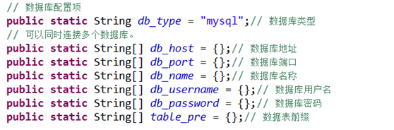  
首先，“db_type”该项表示项目中所使用的数据库类型，目前框架支持两种数据库，分别是“mysql”和“postgresql”如果该值等于“mysql”则表示使用的是mysql数据库，如果该值等于“postgresql”则表示使用的是postgresql数据库。
其次，由于框架支持同时连接多个数据库，因此配置文件中针对数据库地址、数据库名称、用户名、密码……等等均使用了数组方式。
如果只有一个数据库，可以采用类似于下面的这种配置方式：
 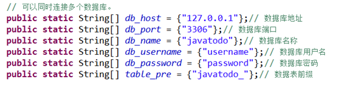  
如果存在项目中连接有多个数据库，可以使用下面的配置方式：
 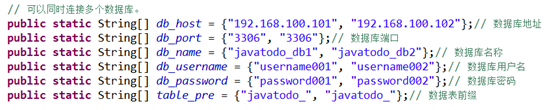  
注意：数据库参数在数据组中的位置需要一一对应。
#（二）	模版引擎与项目编码
 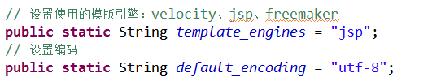  
框架分别支持三种模版方式，分别是“jsp”，“freemaket”，“velocity”；默认是“jsp”
框架的默认编码是“utf-8”
#（三）	路由配置
路由配置部分将会在下一节详细描述。
#（四）	模版文件目录和公共文件目录
 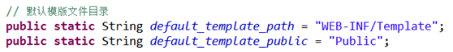  
其中“default_template_path”：表示项目模版文件的存放目录。
“default_template_public”：表示项目的公共文件（比如css js 等等的存放目录）。
如果没有特殊要求，这些配置项不用更改。
#（五）	数据库连接池配置
 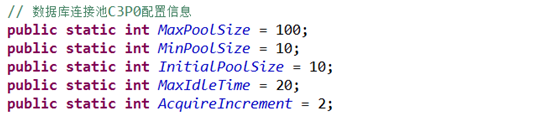  
框架使用的是c3p0数据库连接池，如果没有特殊要求，这些配置项可以不用更改。
#（六）	图片验证码配置
 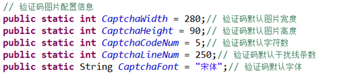  
在一些登录操作中常常会用到图片验证码，框架中也集成了图片验证码的功能，关于图片验证码的一些信息可以在这里进行配置，如果没有特殊要求建议不要更改。
#（七）	上传图片大小配置
 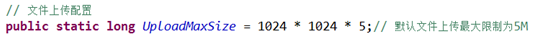  
系统默认的可上传的图片大小为５M以内，如果没有特殊要求建议不要更改。
#二、	路由设置
我们现在已经知道，使用该框架开发应用程序需要先设置“模块（包）”、“控制器名”和“操作”，那么我们该怎么进行访问呢？下面我们来详细介绍一下。
比如，系统已经内置了一个模块，包名是“com.javatodo.app.index”,这里面有一个控制器“IndexController.java”，打开这个文件可以看到：
 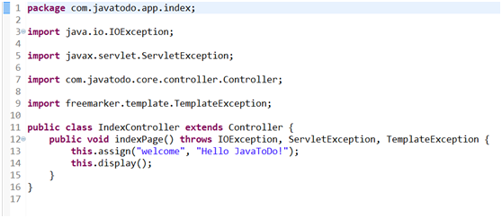  
这里面有一个名为“indexPage”的“操作”，那么我们在浏览器中如何访问这个操作呢？
首先将项目在tomcat中配置好（不会的可以百度），然后打开浏览器，在地址栏中输入：http://127.0.0.1:8080/index.jsp?m=com.javatodo.app.index&c=Index&a=index
就可以看到如下页面：
 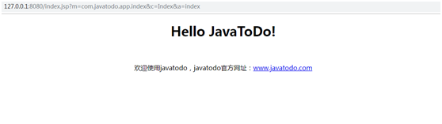  
在这里，http://127.0.0.1:8080/是项目地址，index.jsp就是我们的入口页面了，index.jsp后面有三个参数，分别是m，c，a这三个参数分别表示“模块名”，“控制器名”和“操作名”。也就是说访问这个链接，进入的是“com.javatodo.app.index”模块里面的“IndexController”控制器中的“indexPage”操作。
在了解了基本的路由方式以后有没有觉得这样写比较麻烦，因为通常包名都比较长，并且直接将名字暴露在外面也不太好，于是我们可以继续对路由进行配置，将真实的包名、控制器名和操作名进行隐藏，用其他的名字来替换掉，于是就有了下面这个配置：
 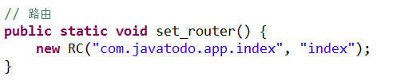  
这样就等于是把“com.javatodo.app.index”用“index”来替换掉，于是这个链接就变成了http://127.0.0.1:8080/index.jsp?m=index&c=Index&a=index
 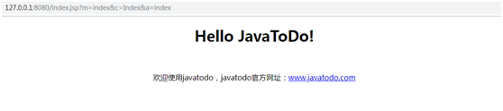  
如果想把包名、控制器名和操作名全替换掉可以采用下面这种方式
 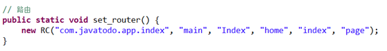  
这样访问的链接就变成：http://127.0.0.1:8080/index.jsp?m=main&c=home&a=page
 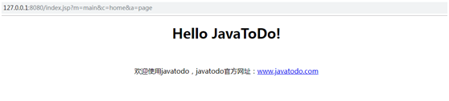  
好了，现在我们已经知道怎么用过链接来访问到我们的应用了，接下来还有个问题，网站的主页该怎么访问？网站的主页应该是通过域名能直接访问而不需要后面的那些参数的，那么我们接下来继续配置：
例如：我们要把http://127.0.0.1:8080/index.jsp?m=main&c=home&a=page这个页面当成主页，想直接通过http://127.0.0.1:8080　来访问的话，我们可以这样配置，
 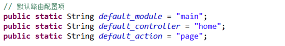  
然后我们在浏览器中输入：http://127.0.0.1:8080　可以看到：
 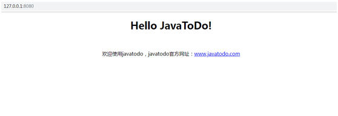  
至此，路由配置完成。

#第四章	控制器
#一、	控制器的定义
控制器是继承了“com.javatodo.core.controller.Controller”类或者其子类的java类，下面是一个典型的控制器的定义：
１、	模块名：也就是包名，com.javatodo.app.index
２、	控制器名：也就是类名，IndexController
３、	操作名：也就是公共方法名，indexPage
   
#二、	初始化操作
在控制器中可以定义一个方法“public Boolean init()”，该方法会在执行所有的操作之前先执行，通常用于变量的初始化以及权限检测等等。
如果该方法返回“true”，则会继续向下执行；如果该方法返回“false”，则终止向下执行。
#三、	前置与后置操作
系统会检测是否存在前置和后置操作，如果存在就会按照顺序执行。前置和后置操作的定义方式如下：
 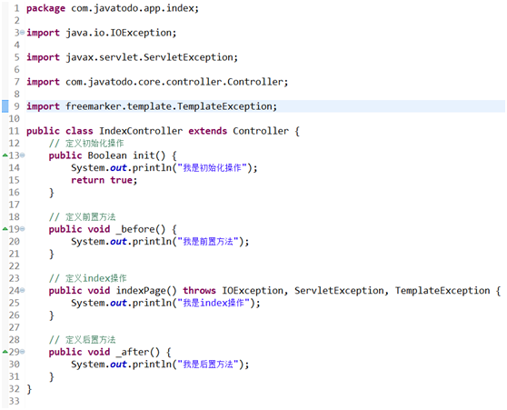  
在浏览器中输入：http://127.0.0.1:8080/index.jsp?m=com.javatodo.app.index&c=Index&a=index
我们可以在tomcat中看到以下输出信息：
   
#四、	URL生成
１、	在控制器中可以通过 以下几种方式来生成url链接
1)	this.U(“模块名/控制器名/操作”); 来生成没有其他参数的链接
2)	还可以创建一个Map<String,String> map，然后将参数全部传入map中，再通过this.U(map)；来生成url链接
示例：
Map<String, String> map = new HashMap<String, String>();
map.put(“m”, “main”);     //m:表示模块名
map.put(“c”, “home”);     //c:表示控制器名
map.put(“a”, “index”);     //a:表示操作名
map.put(“其他参数名”, “其他参数值”);
String  url = this.U(map);
3)	通过 this.U(“模块名/控制器名/操作”, new Map<String, String>参数)来生成url链接。
２、	如果在模版或其他地方生成url链接
1）	通过T.U(“模块名/控制器名/操作”, “入口文件”)；来生成url链接
2）	通过T.U(Map<String, String> 参数, “入口文件”)；来生成url链接
3）	通过T.UJ(“模块名/控制器名/操作”, “json字符串形式的参数”, “入口文件”)；来生成url链接
4）	T.U(“模块名/控制器名/操作”, “参数字符串”, “入口文件”)；
示例程序:
String url = T.U(“main/home/index”, “id=1&cat_id=1”, “index.jsp”);
#五、	输入变量
１、	在控制器中获取输入变量
1）	获取所有的输入变量，可以通过this.I()来获取：
Map<String, String> param_map = this.I();
所有的输入变量都以键值对的方式存入param_map当中。
2）	获取某个具体的变量，可以通过this.I(“变量名”)来获取
String id = this.I(“id”);
２、	在模版中获取输入变量
如果在模版中获取所有的输入变量可以通过
Map<String, String>input_map = (HashMap)request.getAttribute(“input”);来获取所有的变量。
#六、	请求类型
IS_GET 判断是否是GET方式提交。
IS_POST判断是否是POST方式提交
#七、	跳转和重定向
在应用开发当中，经常会遇到一些带有提示信息的跳转页面，例如操作成功或者操作错误的页面，框架在控制器中内置了success和error方法，用于页面跳转提示，而且可以支持ajax提交。
程序执行成功的跳转页面可用this.success(“执行成功”);来获取，反之可以使用this.error(“执行失败”);来获取。

#第五章	数据库操作
#一、	使用数据库
１、	要使用数据库，首先需要初始化一个M方法。
２、	使用m实例中的table方法来确定要操作的数据表，例如：
M m = new M();
m.table(“表名称”);
#二、	连贯操作
１、	where
1)	使用字符串直接查询和操作，例如：
M m = new M();//实例化M对象
List<Map<String, Object>> list = m.table(‘member’).where(“id>1 and id < 10”).select();
最后生成的sql语句是：select * from member where id > 1 and id < 10
2)	map条件，使用map条件可以支持更多的sql查询语法，查询表达式使用以下格式：
map.put(“字段1”, new W(“表达式”, “查询条件1”))；
map.put(“字段2”, new W(“表达式”, “查询条件2”))；
表达式不区分大小写，支持的表达式有下面几种：
表达式	含义
EQ	等于（=）
NEQ	不等于（<>）
GT	大于（>）
EGT	大于等于（>=）
LT	小于（<）
ELT	小于等于（<=）
LIKE	模糊查询
[NOT] BETWEEN	（不在）区间查询
示例：
Map<String, W> where = new HashMap<String, W>();
where.put(‘language’, new W(“eq”, “java”));
where.put(“frame”, new W(“eq”, “javatodo”))
List<Map<String, Object>>list = m.table(“member”).where(where).select();
２、	table，table也属于连贯操作方法之一，主要用于指定操作的数据表。m.table(“javatodo_user”).where(“id < 10”).select();
３、	alias，用于设置当前数据表的别名，便于使用其他的连贯操作
m.table(“javatodo_user”).alias(“u”).join(“javatodo_score”, “as c on u.id=c.uid”, “left”).where(“u.id = 100”).field(“u.*, c.score”).find();
生成的sql语句是：
selet u.*, c.score from javatodo_use as u left join javatodo_score as c on u.id = c.uid where u.id = 100 limit 1;
４、	data，用于设置当前要操作的数据对象的值，示例：
Map<String, Object> save_data = new Hashmap<String, Object>();
save_data.put(“username”, “javatodo”);
save_data.put(“password”, “111111”);
m.table(“member”).data(save_data).add();
５、	field，用于标识要返回的字段，常用于查询等操作，示例：
m.table(“javatodo_user”).alias(“u”).join(“javatodo_score”, “as c on u.id=c.uid”, “left”).where(“u.id = 100”).field(“u.*, c.score”).find();
６、	order，用于对操作的结果进行排序，示例：
List<Map<String, Object>>list = m.table(“member”).order(“id desc”).select();
７、	limit，用于指定查询和操作的数量，特别在分页查询的时候使用较多。该limit方法可以兼容所有的数据库驱动类。示例：
List<Map<String, Object>>list = m.table(“member”).limit(“10”).select();
８、	group，通常用于结合合计函数，根据一个或多个列对结果进行分组。示例：
m.table(“score_log”).field(“username, max(score)”).group(“uid”).select();
９、	join，用于根据两个或多个表中的列之间的关系，从这些表中查询数据。join通常有以下几种类型，不同的join操作会影响返回的数据结果：
1）	inner join：如果表中有至少一个匹配，则返回行，等同于join
2）	left join：即使右表中没有匹配，也从左表返回所有的行。
3）	right join：即使左表中没有匹配，也从右表返回所有的行。
4）	full join：只要其中一个表中存在匹配，就返回行。
join方法可以支持以上4种类型，例如：
m.table(“javatodo_user”).alias(“u”).join(“javatodo_score”, “as c on u.id=c.uid”, “left”).where(“u.id = 100”).field(“u.*, c.score”).find();
join方法可以多次调用，按以下方式来进行调用
join(“表名称”, “匹配条件”, “join操作类型”)
#三、	数据的增删改查
１、	数据的增加
增加数据通常用add()方法，可以参照以下示例：
Map<String, Object> save_data = new Hashmap<String, Object>();
save_data.put(“username”, “javatodo”);
save_data.put(“password”, “111111”);
m.table(“member”).data(save_data).add();
２、	数据的删除
Map<String, W> where = new HashMap<String, W>();
where.put(“id”, new W(“eq”, 1));
m.table(“member”).where(where).delete();
３、	数据的修改
Map<String, W> where = new HashMap(String, W);
where.put(“id”, new W(“eq”, 1));
Map<String, Object> save_data = new HashMap<String, Object>();
save_data.put(“username”, “javatodo”);
save_data.put(“password”, “111111”);
m.table(“member”).where(where).save(save_data);
４、	数据的查询
Map<String, W> where = new HashMap(String, W);
where.put(“id”, new W(“lt”, 100));
List<Map<String, Object>> list = m.table(“member”).where(where).select();
如果是查找单条数据还可以用以下方式：
Map<String, W> where = new HashMap(String, W);
where.put(“id”, new W(“eq”, 1));
Map<String, Object> info = m.table(“member”).where(where).find();

#第六章	模版
一、	控制器向模板传值
在控制器中可以通过this.assign(“变量名”, “变量值”);这种方式向模版中传值。
模版中获取传值（以jsp为例），可以通过以下方式获取传值
String str = request.getAttribute(“变量名”).toString();
#二、	控制器加载模板文件
１、	首先说明一下模板文件的存放位置，如下图所示：
 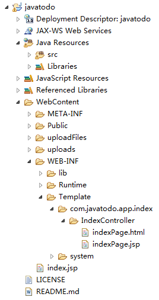  
在WEB-INF文件夹中有一个Template文件夹，模版文件都存放在这个文件夹的下面，如果要更改可以参考配置文件中的模板配置章节。
在Template文件夹中的模板文件也是按照“模块名/控制器名/操作名.jsp”的方式存放，如果采用其他模版引擎比如freemaker等模板文件应该按照“模块名/控制器名/操作.html”存放。
２、	在控制器中加载模版文件。
如果要在控制器中加载模版文件可以使用this.display()方法。
如果display()不带参数，则默认加载“模块名/控制器名/操作名.jsp”的模板文件，如果想加载其他模版文件，可以使用
this.display(“模块名/控制器名/操作名”);
这种方式加载其他的模版文件
